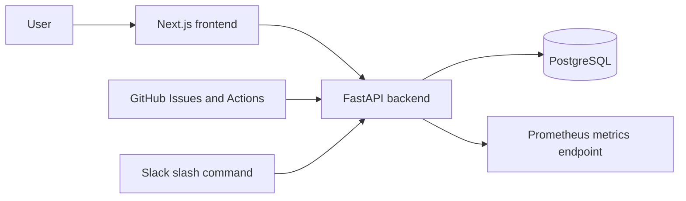
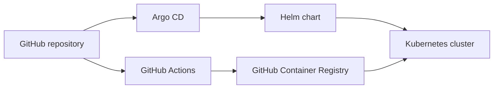
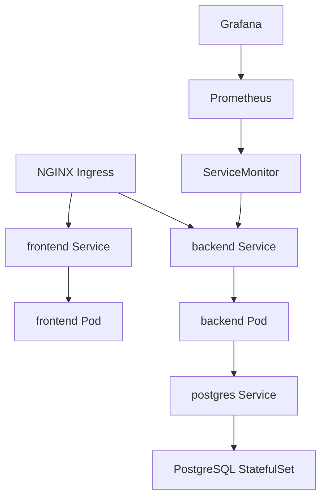

# Architecture

DevOps Task Manager is split into three layers: the app, the delivery pipeline,
and the Kubernetes platform that runs it.

## System Flow

The frontend handles login, task creation, filtering, and GitHub sync actions.
The backend owns authentication, task storage, GitHub imports, Slack task
creation, and Prometheus metrics. PostgreSQL stores users and tasks.

## Delivery Flow

GitHub Actions builds the frontend and backend images and pushes them to GHCR.
Argo CD watches the repository and applies the Helm chart into the Kubernetes
cluster. The chart deploys the frontend, backend, PostgreSQL, ingress rules,
secrets, config, and monitoring resources.

## Runtime View

Ingress routes browser traffic to the frontend and `/api` traffic to the
backend. Prometheus scrapes the backend through the ServiceMonitor, and Grafana
visualizes the Kubernetes and application metrics.
