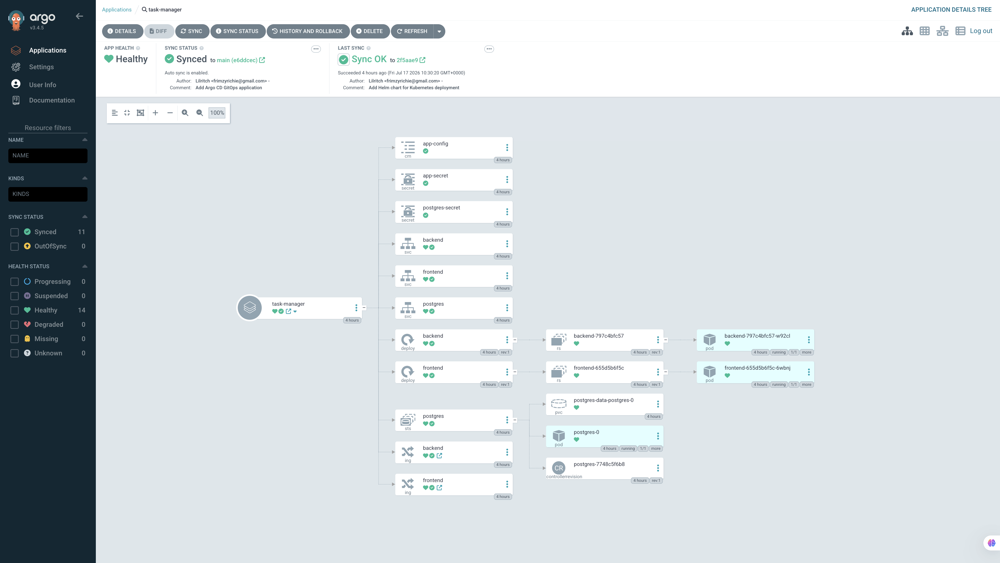
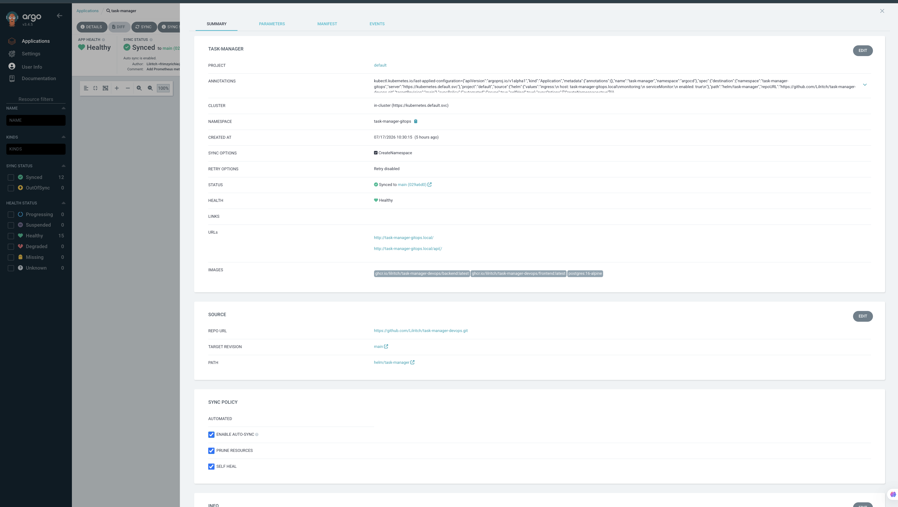
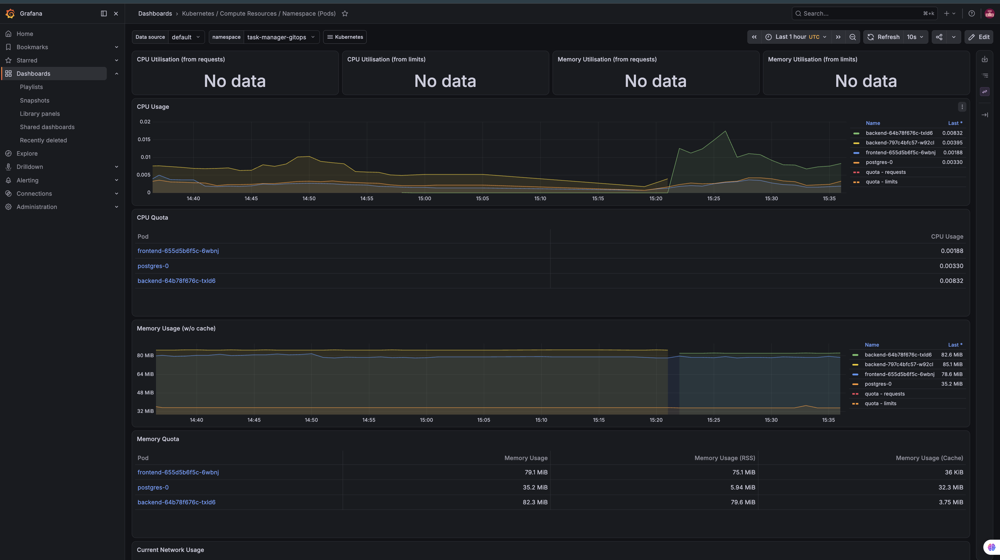
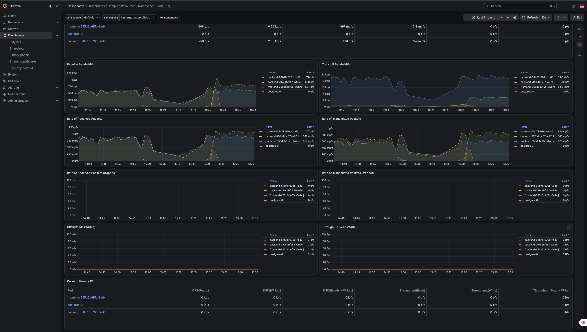

# Project Screenshots

This page collects the main app, GitOps, and monitoring screenshots.

## DevOps Task Dashboard

The dashboard brings together manual tasks, GitHub issues, failed CI work, and Slack-created tasks.

## Argo CD GitOps

Argo CD watches the GitHub repository and deploys the Helm chart into Kubernetes.

The application details show the GitHub repository, Helm chart path, target namespace, and auto-sync settings.

## Grafana Kubernetes Monitoring

Grafana shows CPU and memory usage for the frontend, backend, and Postgres pods in the `task-manager-gitops` namespace.

Grafana also shows network traffic and packet metrics for the same Kubernetes workloads.
